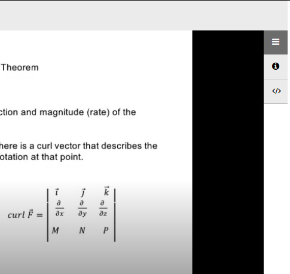
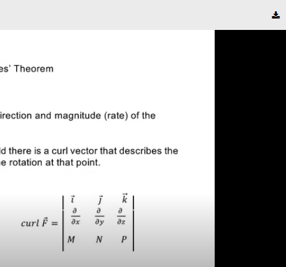

# Ensemblevideo Link Converter 

[](https://raw.githubusercontent.com/dennisfarmer/scripts/master/LICENSE)

Have you ever had to drop a math class that you were initially really thrilled about because the trials of the human condition became too much for your broken soul to bare? Look no further than this _wacky_ python script! If your class uses ensemblevideo.com to host lecture videos, you can convert the link to a video player with a download button. It sure would be a bit more intuitive if the button wasn't disabled in the first place, but at the same time being able to download an entire class for independent study is quite a steal. Jokes on the losers paying for full price online university courses. Doesn't work with cloud.ensemblevideo.com bc those vids are straight cray ig.

### Requirements:
`pyperclip`

### Use:
```zsh
python link_converter.py
```
Press enter to grab clipboard link, convert to downloadable format, then copy new link to clipboard, or q then enter to exit.

#### Before (yucky):
```
https://washtenaw.ensemblevideo.com/hapi/v1/contents/d5cedd1f-a75c-449f-8000-e4f16773d456/launch?idn_playlist=ec4d8686-acfc-44d5-b689-a9ec72a1abc0&idn_init=False&idn_sig=prmGHSxKawTxeGmNOdXKdOX1LGA%3D&?displayTitle=true&startTime=0&autoPlay=true&hideControls=False&showCaptions=False&displaySharing=False&displayAnnotations=True&displayAttachments=True&displayLinks=True&displayDownloadIcon=False&displayMetaData=true&displayEmbedCode=True&audioPreviewImage=False&displayCaptionSearch=True&displayViewersReport=False&displayAxdxs=False&forceDisplayAdsOff=False&embedAsThumbnail=False&playlistId=&displayCredits=False&isJavaScriptEmbed=False&isContentPreview=False&isResponsive=False&useFourByThreeRatio=False&isJavascriptInIframe=False
```


#### After (less yucky):
```
https://washtenaw.ensemblevideo.com/hapi/v1/contents/d5cedd1f-a75c-449f-8000-e4f16773d456/launch?&displayDownloadIcon=True
```



